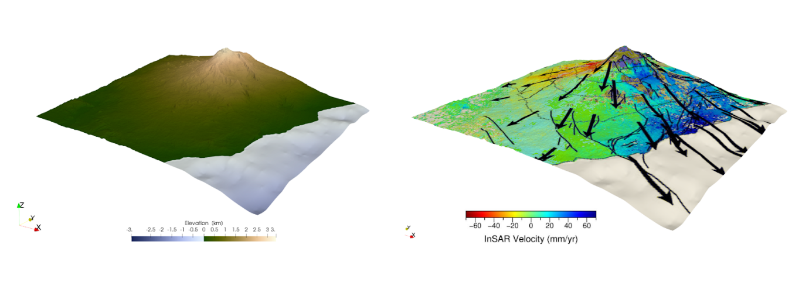
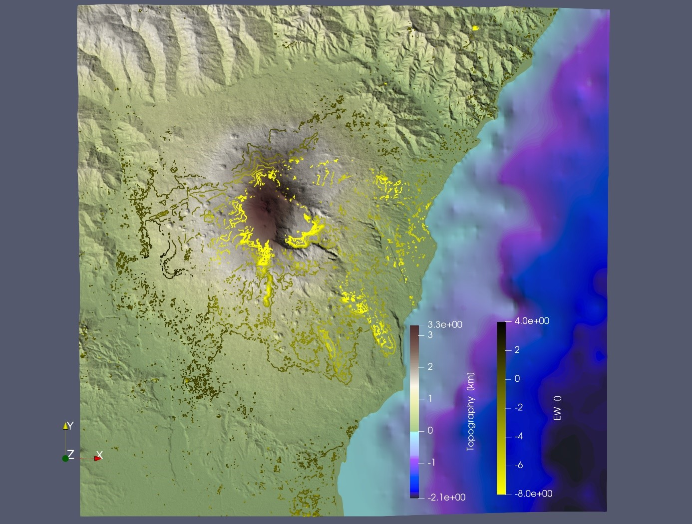
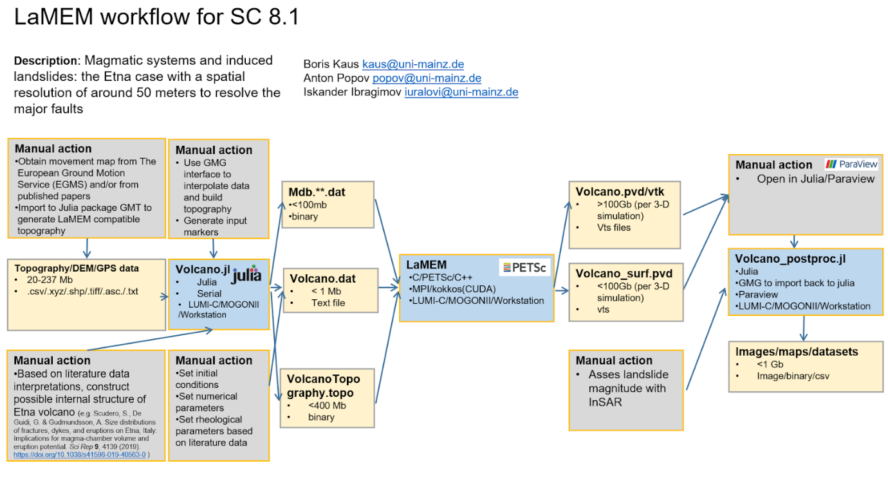

# ChEESE_2p_PD8_1

# ChEESE-2p Project WP5 PD8: Geodynamics to Geohazards. Prototype setup for the Etna volcanic landslide model.

### ISKANDER IBRAGIMOV, BORIS KAUS, ANTON POPOV, UNIVERSITY OF MAINZ
### JUNE 2025
#### Description

This repository contains setup files and links to datasets for Etna volcano landslide model, generated in Julia script using the [GeophysicalModelGenerator.jl](https://github.com/JuliaGeodynamics/GeophysicalModelGenerator.jl), [GMT.jl](https://github.com/GenericMappingTools/GMT.jl) and [LaMEM.jl](https://github.com/JuliaGeodynamics/LaMEM.jl) julia packages.
It is used to run simulations with the geodynamic code [LaMEM](https://github.com/UniMainzGeo/LaMEM/) as part of the PD8 of the ChEESE-2p project.
The slow deformation of the solid Earth takes place over long timescales, involves large strains and non-linear viscoelastoplastic rheologies. This deformation governs processes on a wide range of scales, from fluid flowing through porous rocks on a micrometer scale to the motion of tectonic plates on thousands of kilometers, and controls the stress state of the lithosphere, affects where earthquakes occur, or how magma migrates through the crust. It also affects stresses within sedimentary basins and geothermal reservoirs and thus plays a key role for the long-term safety of nuclear waste deposits. Whereas existing geodynamic codes are typically applied to more basic scientific questions (such as how mountain belts form), they can equally well be used to simulate geohazards such as landslides or coupled geodynamic/seismic simulations. This PD focusses on modelling the flank instability of the eastern slope of the Etna.

#### Objective
The main objectives of this PD are: (1) improve the workflow of geodynamic codes to such an extent that they can be rapidly deployed to simulate any part of the Earth and model output can be compared with observations, (2) export and project material properties and state of stress to other codes for multiphysics modeling purposes and, (3) prepare geodynamic codes for the next generation GPU machines, by improving multigrid strategies, implement matrix free solvers and as well as novel BFBt preconditioners.

#### Files description
1. Volcano.jl - Main setup script, which generates input files for LaMEM model.
2. Volcano.dat - Example of generated by Volcano.jl input file for LaMEM.
3. generate_per_core_marker_files_utils.jl  - Auxiliary scripts with utilities for Volcano.jl
4. Volcano_postproc.jl  - Script to read back the results of LaMEM simultion into Julia and GeophysicalModelGenerator.
5. ReadMe.pdf – File with the description of dataset.
6. Figures
   
#### Model generation workflow
Model is mostly assembled from DEMs and InSAR data as well as literature based information for internal structure. InSAR dataset can be downloaded from EGMS [1] website [2].
First it loads topography from GMT database:
`Topo          = import_topo()`
The model domain covers a rectangular region around Etna volcano, with corner coordinates:
NW: (14.75°, 37.96°)
NE: (15.45°, 37.96°)
SE: (15.45°, 37.43°)
SW: (14.75°, 37.43°).
Which is approximately 61 km in width and 59 km in height.
Then it is projected to regular Cartesian grid with projection point Lon=15.15, Lat=37.65.
Next step is initializing the model. All information about the grid is generated into structure Grid_info and then used during model generation. Model generation is set in a such a way that it loops through each MPI rank (variable n_ranks) and generates markers for LaMEM using Grid_info, and partitioning information in structure P and p_dist. This allows to generate model with much less use of memory, which is crucial when generating high resolution models(>5123), and also allows to parallelize process with Julia base functionality with threads. Script eventually generates model for LaMEM to folder /markers and input file with .dat extension (2).
Currently, model has two stages: elastic loading and landslide stage. During the elastic loading, properties of the phases in the model described only with elastic terms and allows to accumulate stresses in the model to match current stresses on volcano. This stage continues for 40000 years and is regulated with variable  ConstantValue in PhaseTransition function. PhaseTransition function allows to activate plasticity for these phases after initial stress state was established.
To analyse the results another set of scripts will be prepared as a next stage of WP5 and WP6. Results will be imported back to Julia with GeophysicalModelGenerator.jl, viewing is also be possible with Paraview[3].

Figure 1. Topography (left) and east-west directed InSAR velocity of Etna (in the time period from January 2015-December 2018). The InSAR data is taken from Pezzo et al. (2023). Since their data was not made available in digital form, we draped a screenshot of their Fig. 5a on the topography. The significant east-west motion of the eastern flank of Etna is clearly visible.

Figure 2. InSAR data coverage on top of Etna volcano from online EGMS dataset. Top view.

 
Figure 3. Workflow of PD8 for SC8.1.

**References**
1.	Crosetto, M. et al.: DEFORMATION MONITORING AT EUROPEAN SCALE: THE COPERNICUS GROUND MOTION SERVICE, Int. Arch. Photogramm. Remote Sens. Spatial Inf. Sci. 2021, XLIII-B3-2021, 141–146 DOI: 10.5194/isprs-archives-XLIII-B3-2021-141-2021
2.	https://egms.land.copernicus.eu/
3.	https://www.paraview.org/

